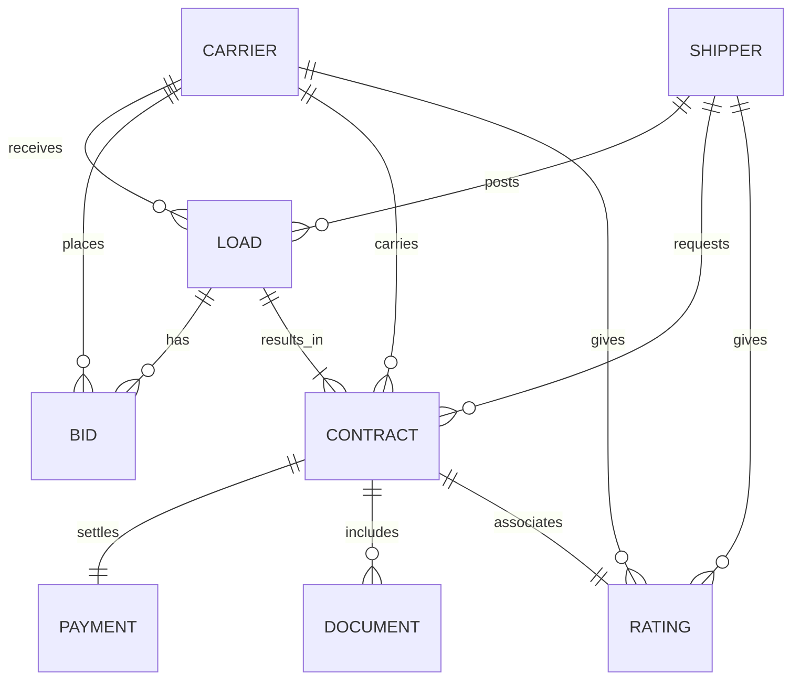
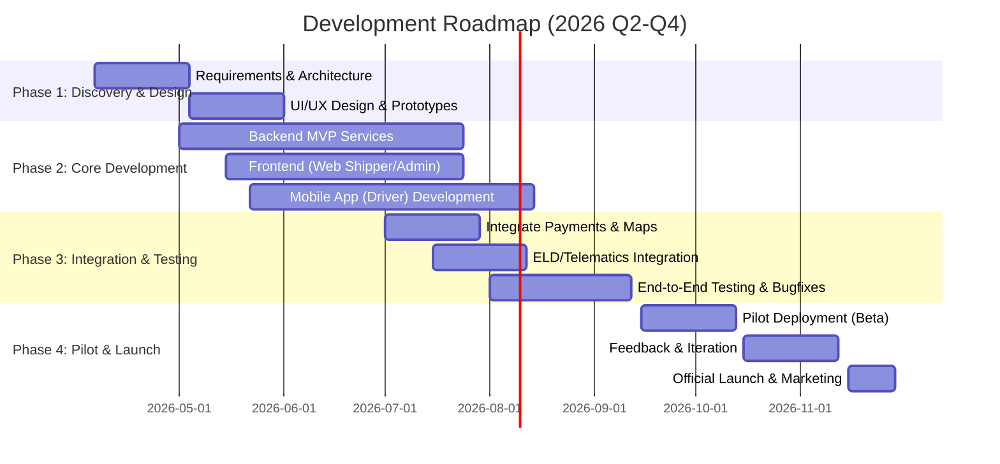

# Executive Summary

We propose to build a **digital freight marketplace** – a web and mobile platform connecting shippers and truck carriers (drivers) much like Uber Freight, Convoy, or Transfix. This platform will allow shippers to post loads and carriers to browse/match and bid on loads, manage shipments, and handle payments – all via easy-to-use mobile and web interfaces. Modern features will include real-time load tracking (via driver apps and ELD telematics), instant pricing and matching algorithms, online document management, and seamless payment processing. By digitizing traditional broker workflows, we aim to reduce paperwork, speed up bookings, and improve transparency for all parties. 

Uber Freight’s success illustrates the opportunity: it handles hundreds of millions in freight annually【24†L149-L155】 and serves a large network (e.g. >6,000 shippers and 65,000 carriers with 1M+ reviews【30†L93-L100】). Building a similar platform requires designing for **three distinct user interfaces** – a driver mobile app, a shipper web portal, and an admin/dispatcher dashboard【24†L150-L155】 – and integrating mapping, payment, compliance (ELD/HOS), and real-time data. Our plan covers all aspects: from defining clear project goals and personas, through detailed feature requirements and data modeling, to technology choices, MVP scoping, phased roadmap, and risk/KPI frameworks. Citations to industry and Uber Freight sources are provided throughout to ground our design decisions.

## Project Goals and Objectives

- **Efficient Load Matching:** Enable shippers to quickly post freight jobs and carriers to find suitable loads via intelligent matching and bidding. Use algorithms (AI/ML) to optimize matches by cost, route, and equipment.  
- **Real-Time Visibility:** Provide continuous shipment tracking. Leverage driver smartphones and integrated ELD/telematics data so shippers and dispatchers see live location, status, and ETAs【5†L39-L46】【22†L314-L321】.  
- **End-to-End Digital Workflow:** Streamline all steps – from load posting and bidding to proof-of-delivery and payment – within the platform. Eliminate phone calls and paperwork by enabling online documentation (BOLs, invoices, permits) and in-app communication【22†L318-L324】【26†L307-L315】.  
- **Transparent Payments & Financials:** Support cashless payments and quickpay options. Carriers can view linehaul, detention, and lumper payment statuses in-app【3†L63-L70】. Shippers get integrated invoice and billing features.  
- **Security and Compliance:** Ensure driver credentials, insurance, and records are verified (to meet DOT/HOS regulations). Secure sensitive data (locations, finances) with best practices (encryption, PCI compliance, RBAC).  
- **Scalable Platform:** Build a robust, cloud-native backend and architecture that can handle high load volumes, real-time updates, and future features (AI pricing, expanded TMS capabilities)【30†L101-L109】【30†L135-L139】.  
- **User Satisfaction:** Deliver a user-friendly experience for each persona (drivers, shippers, dispatchers, admins) with mobile-first design and rapid performance to drive adoption【26†L263-L275】【28†L68-L72】. Measure success by key metrics (see KPIs below).

Our **MVP** will focus on core features: load posting, instant matching/bidding, mobile driver app updates, real-time tracking (via GPS/ELD), in-app messaging/notifications, and payment/invoicing. Subsequent phases will add advanced analytics, predictive routing, and full TMS integrations. The ultimate aim is a unified freight ecosystem: a **single platform** where planning, execution, and finance flow seamlessly (much like Uber Freight’s vision for an “always-on” logistics platform【1†L173-L178】【30†L101-L109】).

## `Claude.md`

### Project Charter  
- **Purpose:** Build a digital freight marketplace (Uber Freight–like) to connect shippers with truck carriers. Automate freight procurement and execution end-to-end.  
- **Scope:** Develop responsive web portals (Shipper, Admin/Dispatcher) and mobile apps (Driver) with core features (matching, bidding, tracking, docs, payments). Integrations with mapping, telematics, and payment systems.  
- **Stakeholders:** Shippers/customers (logistics managers), Carriers/Drivers (truck operators), Dispatchers, Platform Admins, and the Development Team.  
- **Success Criteria:** Functional MVP (able to book and execute shipments with minimal manual intervention); positive user adoption metrics; performance & reliability targets met; on-budget delivery.

### Decision Log  
- **Architecture:** Chose a microservices-based cloud architecture for scalability. Use RESTful APIs with a gateway. Services include: Matching Engine, Tracking Service, Payment Service, Notification Service, etc.  
- **Frontends:** Driver and Shipper apps are separate: mobile (iOS/Android) and web (React single-page app). Admin dashboard is a web portal.  
- **Technology Stack:** Preferred stack: Node.js (backend) + TypeScript, React (web), React Native (mobile)【38†L433-L442】【38†L445-L452】. Mapping with Google Maps/Mapbox【38†L460-L469】, database with PostgreSQL or MongoDB. AWS (or Firebase) for cloud infrastructure【38†L472-L481】. Stripe/PayPal for payments【38†L490-L499】.  
- **Authentication:** OAuth2/JWT with multi-role support (Carrier, Shipper, Dispatcher, Admin). Data encryption at rest/in transit.  
- **ELD Integration:** Use an aggregator (e.g. TruckX Terminal API) to fetch normalized ELD/telematics data【43†L136-L144】.  
- **Trade-offs:** For fastest deployment and cross-platform consistency, we prioritized React Native (single codebase) over fully native apps. We will use Node.js microservices for rapid development and scalability, with possible future support for Go/Java if needed.  
- **Third-Party Vendors:** Plan to integrate Stripe (payments), Twilio (SMS/voice notifications), AWS SNS or Firebase Cloud Messaging (push), SendGrid (email). Use Terminal API (TruckX) for telematics.  
- **MVP Scope:** Only core freight booking and tracking features; no advanced AI initially. Phased rollout of analytics/optimization.

### Architecture Notes  
- **High-Level Design:** The system is a three-tier architecture. Clients (mobile/web) communicate with a load-balanced API Gateway. Business logic is implemented in backend services (e.g. **Matching**, **Dispatch**, **Tracking**, **Payments**) written in Node.js. These services interact with databases (SQL/NoSQL), third-party APIs (maps, telematics, payments), and messaging/notification systems.  
- **Real-Time:** Use WebSockets or a pub/sub (e.g. Redis, AWS SNS) for push updates (status changes, messages).  
- **Data Flow:** When a shipper posts a load, it’s saved in the database and pushed to the **Matching** service which suggests carriers. Carriers see loads on their mobile app via **Load API**. Upon acceptance, a **Shipment/Contract** is created. The **Tracking** service collects GPS/ELD updates and provides a live feed to shipper and dispatcher. Payment info flows through the **Billing** service on delivery.  
- **Scalability:** Deploy backend services in containers (Docker) on a cloud (AWS/EKS or Google/GKE). Use auto-scaling for high traffic. Employ a CQRS pattern if needed for complex queries (e.g. analytics).  
- **Security:** Secure all APIs (HTTPS, token auth). Store documents and sensitive data encrypted. Adhere to PCI-DSS for card payments. Use role-based access control (RBAC) for admin vs user portals. Implement input validation to prevent injection attacks.  
- **Monitoring:** Include centralized logging (ELK stack or AWS CloudWatch), performance monitoring (New Relic/Datadog), and alerting for failures.  

## User Personas

- **Carrier Driver (Owner-Operator):**  
  *Demographics:* Individual owner-driver or small fleet operator. Tech-savvy, always on the road. Relies on mobile device.  
  *Needs:* Find loads that fit truck type and preferred routes. Transparent, fast payments. Easy proof-of-delivery and expense tracking.  
  *Pain Points:* Empty return trips, uncertain paperwork, late payments, double-booking.  
  *Key Tasks:* Sign up and verify credentials; browse/pick loads; update load status; view shipment details and docs; contact dispatcher; get paid.  
  
- **Shipper / Customer (Logistics Manager):**  
  *Demographics:* Warehouse or logistics staff at a manufacturing/retail company. Uses web portal, some mobile.  
  *Needs:* Post freight quickly, compare quotes, track shipments in real time, ensure on-time delivery. Minimize shipping costs and admin overhead.  
  *Pain Points:* Manual broker communication, lack of visibility into shipments, payment delays, managing multiple carriers.  
  *Key Tasks:* Sign up company account; post loads (with details: weight, route, pickup/delivery windows); view carrier bids; book carriers; track in-transit loads; receive invoices and pay; provide feedback on carriers.  

- **Dispatcher / Fleet Manager:**  
  *Demographics:* Works for carrier or a brokerage. Uses web or tablet.  
  *Needs:* Efficiently assign loads to drivers, monitor all trucks’ progress, handle exceptions (weather, delays), communicate with drivers, maintain compliance (HOS, permits).  
  *Pain Points:* Coordinating many drivers, lack of real-time visibility, paperwork (bill of lading), managing regulations.  
  *Key Tasks:* View all active loads and carriers; assign loads to available drivers or approve driver-selected loads; adjust routes; intervene on delays; manage driver documents; ensure compliance reports.  

- **Admin / Platform Operator:**  
  *Demographics:* Company operations or IT staff. Uses web dashboard.  
  *Needs:* Oversee platform health, manage user accounts, moderate content (reviews, fraud detection), generate reports (KPIs, revenue), integrate system data with other enterprise tools.  
  *Pain Points:* Ensuring system uptime, security, and compliance; detecting misuse; handling scaling issues.  
  *Key Tasks:* Create/verify user accounts (shippers/carriers); audit shipments and payments; manage tariffs and rules; analyze platform usage; configure system settings (maintenance windows, new features rollout).  

## User Journeys

### Shipper (Customer) Journey  
1. **Registration & Profile:** Shipper creates a business account (email/SMS verification, company details, upload insurance documents).  
2. **Post Load:** Via web portal, enters load details (origin, destination, equipment needed, weight/dimensions, timeline). Saves as “Available Load”.  
3. **Receive Matches:** System instantly suggests carriers (or conversely, carriers see the load on their app). Shipper reviews carrier profiles/ratings.  
4. **Bidding/Quotes:** Carriers place bids or offer instant-book rates. Shipper compares pricing and transit ETAs.  
5. **Booking:** Shipper accepts a bid or reserves a carrier. This creates a **Shipment** contract. Notifications sent to carrier and dispatcher.  
6. **Tracking:** Shipper follows live tracking on map via portal (updates come from driver app and ELD【5†L39-L46】). Receives notifications (pickup, delays).  
7. **Shipment Execution:** Carrier picks up goods, updates status to “Picked up”, “In Transit”, and “Delivered” via app.  
8. **Document Handling:** Carrier uploads proof-of-delivery (POD) documents, signed waybills, receipts directly in app【22†L318-L324】. Shipper reviews docs online.  
9. **Payment:** On delivery, system generates invoice. Shipper approves and pays through integrated gateway (credit card/ACH). They can monitor status of linehaul, detention, lumper payments【3†L63-L70】.  
10. **Feedback:** Shipper rates the carrier on timely delivery, service quality. Ratings build carrier score.  

### Carrier Driver Journey  
1. **Registration & Compliance:** Driver downloads the mobile app, registers with phone number and email, submits truck/driver details and required documents (license, insurance, USDOT number) for verification.  
2. **App Setup:** Specifies preferences (lanes, hours, equipment, price thresholds). Enables location tracking (GPS) in the app, and connects ELD/telematics if available【5†L39-L46】.  
3. **Load Discovery:** Driver sees a personalized **Load Board** of available loads matching preferences (based on matching algorithm). High-paying/urgent loads may be highlighted.  
4. **Bid/Accept:** Driver reviews load details and either places a bid or instantly accepts if instant-book available. The system may also push recommended loads.  
5. **Dispatch Confirmation:** Once matched, driver receives a confirmation with load details and pickup instructions.  
6. **Pickup & In-Transit:** Driver navigates to pickup using integrated mapping (Google Maps/Truck routing). Upon arrival, confirms pickup in app. In transit, the app continuously sends location updates (GPS/ELD) to allow real-time tracking【5†L39-L46】.  
7. **Proof of Delivery:** Upon reaching destination, the driver collects POD signature and/or uploads photos via the app. They mark the load “Delivered”.  
8. **Document Submission:** Any paperwork (lumper receipts, invoices) can be scanned/uploaded through mobile.  
9. **Payment:** The freight payment and any accessorial fees are automatically processed. Driver checks app to confirm payment date and amounts (linehaul, detention, lumper)【3†L63-L70】.  
10. **Rating:** The driver rates the shipper/dispatcher experience. High ratings improve matching priority.  

### Dispatcher Journey  
1. **View Assignments:** In the web dashboard, dispatcher sees all booked loads, their assigned drivers, and real-time locations.  
2. **Assign Loads:** When new loads arrive or changes occur, dispatcher can manually assign or reassign loads to drivers, overriding if necessary.  
3. **Monitor Progress:** Tracks timelines and alerts (e.g. delays). If a driver falls off-schedule, dispatcher intervenes (calls driver via app, reoptimizes route).  
4. **Communicate:** Sends messages or alerts to drivers through in-app chat or push (e.g. “change in delivery location”).  
5. **Compliance Checks:** Verifies that drivers have updated HOS logs (through telematics data) and valid permits/insurance before and during trips.  

### Admin Journey  
1. **User Management:** Admin adds/removes user accounts (shippers, carriers), resets passwords, and handles escalations (fraud, disputes).  
2. **Analytics Dashboard:** Views system-wide KPIs: load volume, revenue, average match time, on-time %【30†L128-L136】. Identifies bottlenecks (e.g. low matching rates on certain lanes).  
3. **Rules & Settings:** Configures pricing surges, accessorial rules, cancelation policies, or regional pricing adjustments.  
4. **Support & Moderation:** Accesses logs/chats to resolve disputes, flags malicious users. Reviews reported issues (e.g. claims of late delivery).  
5. **Reporting:** Exports data (CSV/reports) for accounting or compliance audits (e.g. DOT audits, insurance claims).  

## Core and Optional Features

| **Feature Category**       | **Core (MVP)**                                                                                           | **Optional / Advanced**                                                    |
|----------------------------|-----------------------------------------------------------------------------------------------------------|---------------------------------------------------------------------------|
| **Load Matching**          | Shipper can post loads; carriers can browse loads. Automated matching suggestions (basic algorithm).      | AI-driven matching (learn preferences). Multi-stop and LTL matching.       |
| **Load Posting & Bidding** | Web form for load details (origin, destination, trailer type, weight, dates). Carrier bidding or instant book. | Contract bidding/RFP mode with scenario analysis (like Uber Freight Exchange【1†L114-L123】). |
| **Real-Time Tracking**     | GPS-based map tracking on driver app; status updates (picked up, delivered).                             | ELD/telematics integration for continuous tracking (no phone needed)【5†L39-L46】. Geofencing alerts. |
| **Payments & Invoicing**   | In-app payments (credit/ACH). Automated invoice generation on delivery. View payment status (linehaul, detention, etc.)【3†L63-L70】. | Instant quick-pay options. Multi-split billing (for multiple stops). Carrier payroll integration. |
| **Documents**              | Digital upload of POD, lumper receipts, BOLs by driver. Shipper can view and approve docs.              | OCR extraction of documents. Smart document routing (auto-approval workflows). |
| **Notifications/Alerts**   | Push/SMS/email for new load alerts, booking confirmations, status changes, document requests.           | AI-driven proactive alerts (e.g. predicted delays). Two-way chat between shipper-dispatcher-driver. |
| **Ratings & Reviews**      | 5-star rating of carrier by shipper (and vice versa) after each delivery. Display average ratings.         | Verified reviews linked to accounts. Gamification for high-rated users.    |
| **Order History & Analytics** | Shipper view of past loads, performance data, spending.                                              | Advanced analytics: lane profitability, carbon footprint reports, capacity planning recommendations. |
| **Admin Dashboard**        | Basic user management, KPI monitoring (load count, revenue), simple reports.                            | AI / ML analytics (predictive demand, pricing). Rich BI integration (e.g. export to PowerBI). |
| **Security & Compliance**  | Role-based access, encrypted data, identity verification, accessorial checks.                           | Fraud detection algorithms (flag suspicious bids), multi-factor auth, SOC2 compliance reports. |

Most core features are drawn from Uber Freight and other platforms【22†L314-L321】【22†L332-L341】【26†L263-L275】【26†L299-L307】. For example, **real-time tracking** and **digital paperwork** were highlighted as essential on similar apps【22†L314-L321】, and **AI-driven matching/analytics** is emerging as a differentiator【26†L284-L292】【26†L327-L334】.

## Functional Requirements

- **User Accounts:** Must allow creation of Shipper, Carrier (Driver), Dispatcher, and Admin accounts with role-specific permissions.  
- **Load Posting:** Shipper can create/edit/delete “Load” entries (including pickup/delivery locations, weight, dims, special requirements, desired date/time).  
- **Load Matching & Booking:** System automatically matches posted loads with eligible carriers. Carriers can view loads, bid or accept. Once booked, a Shipment/Contract record is created.  
- **Scheduling & Routing:** Provide optimal route suggestions for assigned loads (using real-time traffic). Allow carriers to schedule recurring shipments.  
- **Tracking:** Capture and display live location updates during transit. Status events (Picked Up, In Transit, Delivered) must be logged. Location updates should come at configurable intervals or via telematics.  
- **Document Management:** Provide secure upload/download of documents (BOL, POD, receipts). Flag missing documents and allow users to upload missing ones【3†L85-L92】.  
- **Messaging & Notifications:** In-app messaging between shipper-carrier-dispatcher. Automatic notifications for key events (booking, status change, doc request, payment).  
- **Payment Processing:** Integration with PCI-compliant gateway. Handle invoicing, tracking of multiple fees (linehaul, detention, lumper). Display payment status per load【3†L63-L70】.  
- **Ratings System:** After a delivery, allow both parties to rate and review one another (1–5 stars). Display average scores on user profiles.  
- **APIs:** Expose REST endpoints for integration (e.g. to corporate TMS), including load/cargo data, tracking updates, and pricing. Follow secure authentication.  
- **Analytics & Reporting:** Collect data for KPIs (load volumes, on-time %, revenue). Provide dashboards for admins and business users.  
- **Mobile & Web Apps:** Responsive, user-friendly interfaces. Mobile apps must function offline (cache crucial data) and sync when online【26†L318-L321】.  
- **Integration:** Connect with third-party systems (see below). Sync carriers’ truck/driver data via ELD API.  

## Nonfunctional Requirements

- **Performance:** Support thousands of concurrent users. System should scale horizontally (microservices and cloud autoscaling). APIs should respond in <500ms under normal load.  
- **Availability:** Target 99.9% uptime. High-availability deployment (multi-AZ, automated failover).  
- **Scalability:** Designed to grow to large freight volumes. Use load balancers, stateless services, and database scaling (replication, sharding if needed).  
- **Security:** Encrypt data at rest and in transit (HTTPS/TLS). Role-based access and strong authentication. PCI-DSS compliance for payments (e.g. use Stripe tokens)【38†L490-L499】. Protect user PII per GDPR/COPPA if applicable.  
- **Maintainability:** Clean modular code with CI/CD pipelines for fast iterations. Use logging and monitoring for quick diagnosis.  
- **Usability:** Intuitive UI with minimal training. Mobile-first design (78% of bookings on mobile【26†L284-L287】). Ensure quick load times even on weak networks.  
- **Localization:** Support multiple regions/timezones if expanded globally.  
- **Regulatory Compliance:** Adhere to trucking regulations (ELD mandates, HOS limits, hazardous materials rules). Data retention policies for auditing.  
- **Legal/Privacy:** Draft clear terms of service. Allow users to delete data to meet privacy laws.  

## Data Model (ER Diagram)

The main entities are **Shippers**, **Carriers (Drivers)**, **Loads** (Shipments), **Bids/Contracts**, **Vehicles**, **Documents**, **Payments**, and **Ratings**. A simplified Entity-Relationship diagram is shown below:

**Legend:** A Shipper posts many Loads; a Carrier may bid on many Loads; each accepted bid creates a Contract (Shipment). Vehicles (trucks) can be associated with Contracts. Payments tie to Contracts, as do uploaded Documents (PODs, receipts) and mutual Ratings. This model follows typical freight/TMS designs【32†L48-L58】【26†L299-L307】.  

## API Surface (Endpoints)

We will expose a RESTful API. Sample endpoints (subject to final design):

- **Authentication:** `POST /auth/login`, `/auth/register` (for each role), `/auth/verify`.
- **Shipper APIs:** `POST /loads` (create load), `GET /loads` (list their loads), `GET /loads/:id/bids`, `POST /loads/:id/assign` (accept bid), `GET /shipments` (current shipments), `POST /shipments/:id/rate`, etc.
- **Carrier APIs:** `GET /loads/available` (browse loads), `POST /loads/:id/bid`, `PUT /bids/:id/accept` (if instant booking), `GET /myShipments`, `PUT /shipments/:id/status`, `POST /shipments/:id/documents`, `GET /payments`, etc.
- **Dispatcher/Admin APIs:** `GET /shipments` (all), `PUT /shipments/:id/assign` (re-assign), `GET /analytics`, `POST /users`, etc.
- **Misc:** `GET /trucks`, `POST /trucks`, `GET /routes/optimize`, `POST /notifications/send`, etc.
- **Integrations:** Webhook endpoints for telematics (to receive ELD updates), for payment callbacks, for sending SMS/email, etc.  

Security tokens (JWT) and role checks will guard all endpoints. APIs will be documented (e.g. via OpenAPI/Swagger) for internal and external use【30†L101-L109】.

## Technology Stack Options

Below is a comparison of technology options for each major component. We selected the bolded choices as our primary candidates (based on team expertise and ecosystem fit):

| Component            | Option A (Selected)         | Option B                     | Option C                    | Notes/Citations                                       |
|----------------------|-----------------------------|------------------------------|-----------------------------|-------------------------------------------------------|
| **Frontend Web**     | **React (Next.js)**         | Angular                      | Vue.js                      | React is widely used for SPAs (Airbnb, Instagram)【38†L445-L452】. |
| **Mobile App**       | **React Native**            | Flutter                      | Native (Swift/Kotlin)       | Cross-platform React Native accelerates dev. Flutter is modern but less mature in logistics. |
| **Backend**          | **Node.js (Express/Nest)**  | Python (Django/Flask)        | Java (Spring Boot)          | Node.js excels in real-time, uses same JS skillset【38†L433-L442】. Python/Java strong but higher latency/dev cost. |
| **Database**         | **PostgreSQL**              | MongoDB                      | MySQL                       | Relational DB handles complex queries (joins for TMS) well. Mongo good for flexible docs. |
| **Real-Time Messaging** | **WebSocket + Redis**    | Firebase Realtime DB         | Apache Kafka                | WebSockets (Socket.IO) for live updates. Redis pub/sub for scaling. Firebase/SignalR possible. |
| **Mapping/Geolocation** | **Google Maps API**     | Mapbox                       | OpenStreetMap APIs          | Google Maps is de facto standard (billion users)【38†L460-L469】. Mapbox for customization, OSM free but limited features. |
| **Payment Gateway**  | **Stripe**                  | PayPal                       | Braintree                   | Stripe/PayPal provide PCI-compliant tokenization【38†L490-L499】. Stripe has robust APIs. |
| **Cloud / Hosting**  | **AWS (EC2, Lambda, RDS)**  | GCP (Compute Engine, Cloud SQL)| Azure (VMs, CosmosDB)   | AWS has the richest serverless support (Lambda, SNS) and global coverage. Firebase (MBaaS) could be used for rapid MVP【38†L472-L481】. |
| **Push Notifications** | **Firebase Cloud Messaging** | OneSignal                  | Twilio Programmable Chat    | FCM for mobile push (free). Twilio for SMS/voice if needed. |
| **CI/CD & DevOps**   | **GitHub Actions + Docker** | Jenkins + Kubernetes         | GitLab CI + Helm            | GitHub Actions integrates with GitHub repo. Docker containers for consistency. Kubernetes (EKS) for orchestration. |
| **Monitoring**       | **Prometheus & Grafana**    | Datadog                      | New Relic                   | Prometheus/Grafana open-source for metrics. Sentry for crash reporting. |
| **Auth/Identity**    | **OAuth2/JWT (Keycloak)**   | Auth0                        | AWS Cognito                 | Keycloak (open source) or Auth0 (managed) for user auth and roles. |

Many sources recommend Node.js/React for logistics apps【38†L433-L442】【38†L445-L452】, Google Maps for routing【38†L460-L469】, and Stripe for payments【38†L490-L499】. We will evaluate cost, team skill, and scalability for each choice during design.

## Security, Privacy & Compliance

- **Authentication & Access Control:** Use OAuth2/OpenID Connect and JWT tokens. Enforce **role-based permissions** (carrier vs shipper vs admin). Support multi-factor authentication for admin accounts.  
- **Data Protection:** Encrypt all sensitive data in transit (TLS) and at rest (AES-256 on databases). Do not store raw payment data (use tokenization via Stripe/PCI compliance【38†L490-L499】). Regularly rotate keys/certificates.  
- **User Privacy:** GDPR compliance (if serving EU users): allow data export/deletion, get consent for notifications. Only collect needed data (no unnecessary location logging).  
- **Payment Compliance:** Follow PCI-DSS standards by using hosted fields/tokenization (Stripe, Braintree)【38†L490-L499】. Implement fraud checks on payments (3D Secure, limit small accounts).  
- **Carrier Compliance:** Ensure ELD (Electronic Logging Device) regulation compliance (e.g. US FMCSA 49 CFR Part 395). Require carriers to connect FMCSA-certified ELD or integrated telematics, and capture HOS (Hours of Service) data【5†L39-L46】.  
- **Platform Security:** Conduct regular security audits (SAST/DAST), penetration testing. Use Web Application Firewall (WAF) and DDoS protection on cloud. Keep servers patched.  
- **Audit & Logging:** Log all critical actions (logins, bids, bookings, status changes) for audit trails. Retain logs for compliance periods.  
- **Privacy:** Sensitive PII (driver license, insurance numbers) must be stored securely with limited access. Comply with data protection laws (GDPR, CCPA) depending on region.  
- **Compliance Certifications:** Aim for industry certifications if needed (SOC 2 for enterprise shippers, ISO 27001).  
- **Privacy by Design:** Build the app to minimize tracking – e.g. only poll GPS when needed for active loads (but ELD covers the rest)【5†L39-L46】.  

## Third-Party Integrations

To accelerate development and leverage existing systems, integrate with:

- **Telematics/ELD Providers:** Use a unified API like TruckX’s **Terminal API** to connect to dozens of ELD/telematics vendors【43†L136-L144】. This provides normalized GPS, hours-of-service, vehicle performance and safety data without building many individual integrations. Alternatively, allow carriers to log in to their ELD accounts (Link flow) for data sync【43†L148-L152】.  
- **Mapping/Routing:** Google Maps API (or Mapbox) for geocoding, routing with truck-legal roads, traffic-aware ETA. Use an OSRM or trucking navigation provider (Garmin / HERE) for heavy-vehicle routing if needed.  
- **Payments:** Stripe (credit cards, ACH) or PayPal for processing freight payments. Support popular trucking payment solutions (e.g. EFS, Comdata) if carriers need them.  
- **Communication:** Twilio (programmable SMS/voice) for critical alerts and dispatch calls. SendGrid/Mailgun for email notifications. In-app chat SDK (e.g. Firebase Chat) for messaging.  
- **Document OCR:** Integrate OCR (e.g. Amazon Textract, Google Vision) to auto-extract data from uploads (loads, receipts) for validation.  
- **Accounting/TMS Systems:** APIs or EDI for enterprise shippers (e.g. SAP, Oracle), so shipment data flows into their ERP/TMS.  
- **Load Boards & Data Feeds:** Optionally connect to DAT, Truckstop, or similar load board APIs for aggregated freight data.  
- **Fuel & Compliance:** Integration with fuel card providers (to suggest fueling points) and compliance services (CarrierWatch for insurance).  
- **DevOps/Infra:** CI/CD tools (GitHub, Jenkins), container registry (DockerHub), cloud (AWS/GCP/ Azure).  

By leveraging these third-party services, we focus on core differentiators and speed up MVP delivery.

## MVP Scope

The **Minimum Viable Product** (Phase 1) will include:

- User registration/login (Driver, Shipper roles) with profile setup and basic KYC (upload license/insurance).  
- Shipper: Post loads with key details. Browse/receive bids. Book a carrier for the load.  
- Carrier: View loads matching truck specs. Place bids or accept loads.  
- Basic **Matching Engine**: Simple rule-based matching (by equipment, route, dates).  
- Shipment tracking: Carriers update status (via mobile UI: “Picked up”, “In transit”, “Delivered”). Location tracking via phone GPS (with permission) or manual updates.  
- Document upload: Carrier can attach proof-of-delivery or receipts.  
- Payment: Stripe integration for load payments. Automated invoice generation upon completion. Dashboard for shippers to pay and drivers to see status【3†L63-L70】.  
- Notifications: Email/push notifications for booking confirmations and status changes.  
- Ratings: After delivery, both parties can rate each other (enforce mutual feedback).  
- Web dashboards: Shipper portal to manage loads and view status; simple Admin dashboard to see KPIs (number of shipments, pending payments).  

This covers the **core value cycle**: post → match/book → execute → pay/close. Optional and advanced features (AI matching, advanced analytics, multi-stop loads, ELD telematics, etc.) will roll out in later phases after validating MVP.

## Phased Roadmap and Milestones

We break the project into phases, each with clear milestones. A high-level Gantt chart is shown below:

- **Phase 1 (April–May 2026):** Detailed requirements, architecture and design. Finalize tech stack. Develop wireframes and project charter (the above deliverables).  
- **Phase 2 (May–July 2026):** Core engineering. Develop backend services (Load, Bid, Shipment, User management), web frontend (React) for shippers/admin, and driver mobile app (React Native).  
- **Phase 3 (July–September 2026):** Integrations and testing. Hook up Stripe (payments), mapping APIs, and ELD/telematics data via Terminal API【43†L136-L144】. Perform thorough QA (unit, integration, security, load testing).  
- **Phase 4 (Sep–Nov 2026):** Launch pilot with select users. Gather feedback, polish UI/UX. Scale infrastructure. Official launch with marketing. 

## Resource Roles & Estimates

To deliver the MVP in ~8–9 months, we estimate the following roles (assuming a small to mid-sized team):

| Role                  | Responsibilities                                         | FTE (approx) |   | 
|-----------------------|----------------------------------------------------------|-------------|---|
| Project Manager / PO  | Requirements, backlog, stakeholder communication         | 0.5         |   |
| Backend Engineers (x2)| Build APIs, database design, integrations, devops scripts| 1.5         |   |
| Mobile Developers (x2)| iOS/Android app development (React Native)               | 1.5         |   |
| Frontend Engineers (x2)| Web UI (React) for shipper and admin dashboards         | 1.5         |   |
| UX/UI Designer        | Wireframes, high-fidelity designs, prototyping           | 0.5         |   |
| QA/Test Engineer      | Automated tests, manual regression, performance testing  | 1.0         |   |
| DevOps/Cloud Engineer | CI/CD, cloud infra setup, monitoring, security           | 0.5         |   |
| Business Analyst      | Market research, persona/journey mapping, KPIs          | 0.5         |   |
| *Total FTE*           |                                                          | *7.0*       |   |

*Estimates are for the development phases. Additional support (legal, HR, customer support) is not included.*

## Timeline & Cost Estimates

Using industry benchmarks, our 9-month MVP could range as follows (low–mid–high):

| **Phase / Activity**    | **Low**     | **Mid**     | **High**      | **Notes**                           |
|------------------------|-------------|-------------|---------------|-------------------------------------|
| **Discovery & Design** | $15k        | $25k        | $40k          | Requirements, prototypes.           |
| **Backend Dev**        | $30k        | $50k        | $80k          | Core services (API, DB, auth).      |
| **Frontend Dev**       | $20k        | $35k        | $60k          | Shipper & Admin portals.            |
| **Mobile Dev**         | $25k        | $40k        | $65k          | Driver app (iOS/Android).           |
| **Integrations**       | $10k        | $20k        | $30k          | Maps, payments, ELD, others.        |
| **Testing & QA**       | $5k         | $10k        | $15k          | Automated/Manual testing.           |
| **DevOps/Infra**       | $5k         | $10k        | $15k          | Cloud setup, CI/CD, monitoring.     |
| **Misc (Project Mgmt)**| $5k         | $10k        | $15k          | PM, meetings, overhead.             |
| **Total (MVP)**        | **$95k**    | **$200k**   | **$300k+**    | Broad range (features, rates).      |

These figures align with industry data: Innovecs (2026) suggests custom logistics app costs ~$30K–$100K【36†L68-L76】, though complex apps often reach six figures. Our *Low* estimate assumes minimal features and offshore rates; *Mid* includes some advanced features; *High* covers top-end UI/UX and onshore talent.

Ongoing costs (after launch) include hosting (server/database), third-party service fees (mapping calls, messaging, etc.), and annual maintenance (~15–20% of development cost【36†L69-L76】 for updates and support).

## Risk Analysis & Mitigation

- **Market Competition:** Big incumbents (Uber Freight, Convoy). *Mitigation:* Focus on niche lanes, personalized service, or vertical specialization (e.g. refrigerated loads). Continually enhance unique features (e.g. AI-matching).  
- **User Adoption:** Carriers may mistrust digital initially (used to brokers). *Mitigation:* Offer incentives (fuel rewards, quick-pay), emphasize transparency of ratings and payments (Uber Freight’s success partly due to trust【30†L93-L100】). Provide excellent support.  
- **Technical Complexity:** Real-time tracking and multi-party sync is hard. *Mitigation:* Use proven frameworks (WebSockets, Firebase) and thoroughly test scenarios (offline, handoffs)【26†L318-L321】.  
- **Data Accuracy:** GPS/ELD data might be missing or wrong. *Mitigation:* Require carriers to connect ELD/HOS data early, validate locations (Terminal API normalization【43†L136-L144】), and allow manual status override.  
- **Compliance Risk:** Failure to meet regulations (e.g. FMCSA ELD rule, tax laws). *Mitigation:* Consult legal experts early, embed compliance checks (e.g. stop dispatch if HOS limit reached).  
- **Security Threats:** Data breach or fraud (e.g. fake shipments). *Mitigation:* Encrypt data, use multi-factor auth for sensitive ops, monitor usage patterns for anomalies.  
- **Integration Delays:** Third-party APIs (maps, payments, telematics) may change or fail. *Mitigation:* Abstract integrations behind service layers, keep them modular. Have fallback plans (e.g. store coords if maps API offline).  

Regular risk reviews will be conducted. In each development sprint, we’ll address the top risks with dedicated tasks (e.g. a spike on telematics integration before committing).

## Key Performance Indicators (KPIs) & Metrics

We will track metrics to measure success and inform decisions:

- **Adoption Metrics:** Number of active shippers and carriers; daily/monthly active users; app downloads.  
- **Marketplace Liquidity:** Number of loads posted per day; load-booking rate (percentage of loads quickly matched vs canceled); carrier match rate (how often top bids are accepted).  
- **Operational Efficiency:** Average time to book a load; average empty miles (driver efficiency); average on-time delivery rate.  
- **Financial:** Gross transaction value (GTV) per period; revenue (commissions); average payment cycle time.  
- **User Experience:** Net Promoter Score (NPS) for shippers and carriers; average rating scores【30†L93-L100】; helpdesk tickets or complaints.  
- **System Performance:** API response times; mobile app crash rate; system uptime.  
- **Growth Indicators:** Customer retention rates (repeat usage), expansion of fleet coverage.  

These KPIs will be monitored via dashboards (using Grafana/BI tools) and reviewed in weekly management reports. For example, Uber Freight’s ecosystem leverages over a million reviews to drive trust【30†L128-L136】; similarly, we will track feedback loops to improve our platform continuously.

## Testing, Deployment & Monitoring Plan

- **Testing Strategy:** Adopt Test-Driven Development (TDD) where feasible. Maintain comprehensive unit tests (target ~80% code coverage) for backend services. Develop automated integration tests (API tests) and end-to-end UI tests (e.g. with Cypress for web, Appium for mobile). Conduct regular manual QA: functional, usability, and regression testing each sprint. Include performance/load testing (e.g. simulate many simultaneous bookings) to ensure scalability. Security testing (OWASP Top 10) will be done before launch.  

- **CI/CD Pipelines:** Configure continuous integration using GitHub Actions (or Jenkins/GitLab CI). On each commit, run automated build, lint, unit tests, and code quality checks. Merge to `develop` branch triggers deployment to a staging environment (with test data). After passing tests, we can release to production with pull-request approvals. Dockerize services and use Kubernetes (EKS) for container orchestration.  

- **Staging & Production:** Set up separate staging environment mirroring production. Use Infrastructure-as-Code (Terraform/CloudFormation) for reproducible deployments. Implement blue-green or canary deployments to minimize downtime.  

- **Monitoring & Alerting:** Deploy Prometheus/Grafana to monitor server metrics (CPU, memory, DB queries). Use Sentry or similar for mobile/web crash reporting. Set up real-time alerts (PagerDuty/Slack) for critical issues (e.g. service down, payment failures). Collect logs centrally (Elastic Stack or AWS CloudWatch Logs) for troubleshooting.  

- **Post-Launch Support:** Plan on-call rotation during initial launch months. Use A/B testing for new features. Gather user feedback (in-app surveys) and iteratively improve. 

Regular backups of database and user-uploaded files will be automated. A rollback plan will exist (e.g. DB snapshots) in case of deployment failures.

**Sources:** We incorporated official Uber Freight descriptions【3†L63-L70】【5†L39-L46】, industry articles【22†L312-L321】【26†L263-L275】【28†L68-L72】, and development guides【36†L68-L76】【38†L433-L442】 to shape this plan. Mermaid diagrams illustrate our planned data model and architecture, and tables compare technical choices and cost ranges to ensure informed decision-making. 

